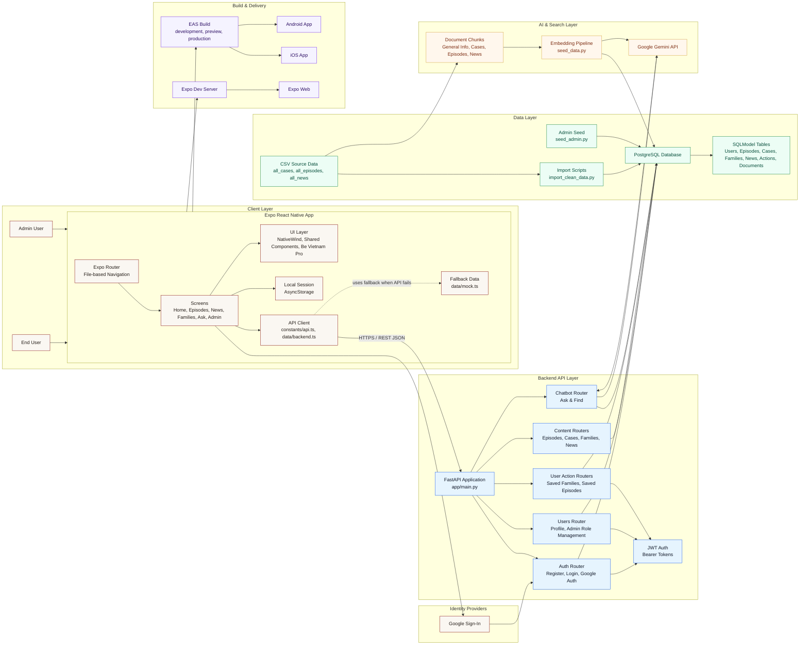
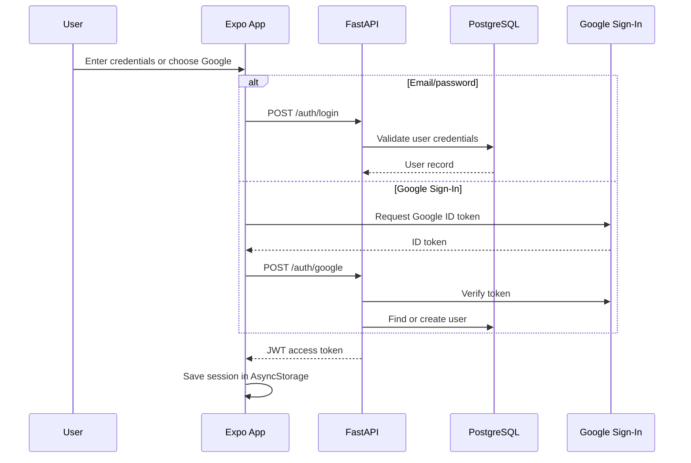
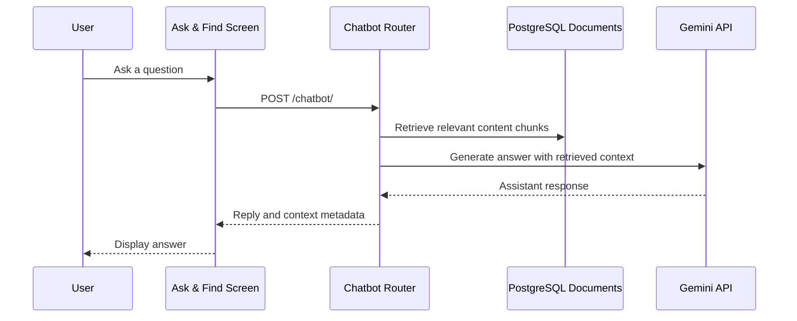

# System Architecture

## Architecture Summary

The application is organized into five main layers:

| Layer | Responsibility |
| --- | --- |
| Client Layer | Mobile UI, navigation, local session persistence, API calls, and fallback data. |
| Backend API Layer | Authentication, role-based access, content APIs, user actions, and chatbot endpoint. |
| Data Layer | PostgreSQL persistence, SQLModel tables, CSV import scripts, and admin seed data. |
| AI & Search Layer | Gemini-powered assistant, embeddings, document chunks, and RAG-style retrieval. |
| Build & Delivery | Expo development workflow and EAS build profiles for Android, iOS, and web. |

## Key Request Flows

### Login Flow

### Ask & Find Flow

